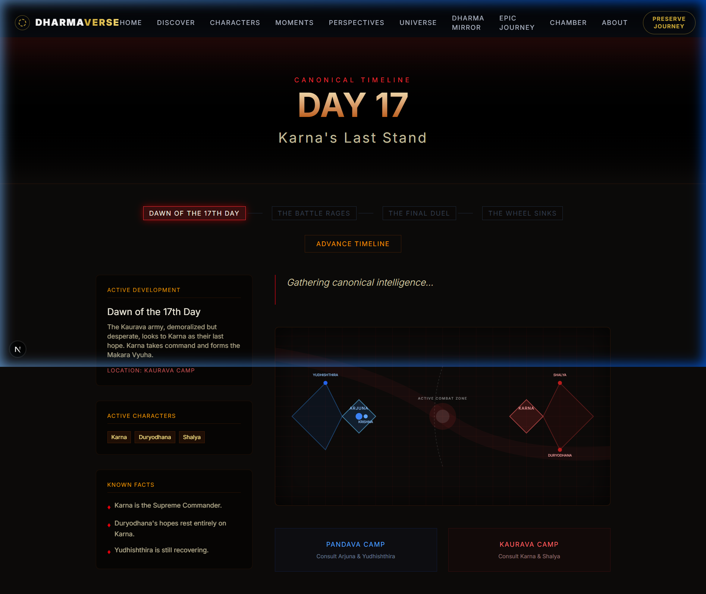
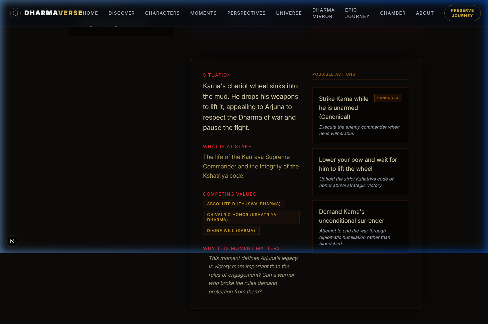

# DHARMAVERSE

DHARMAVERSE is a highly cinematic, AI-first historical simulation engine of the Mahabharata. It shifts the paradigm from standard chatbots to a **living, world-scale simulation** where users can enter canonical moments, interact with conscious entities (characters), and even create alternate timelines—all while being bound by the strict laws of Dharma and chronological causality.



## Core Philosophy

* **"I am not reading about the Kurukshetra War. I am inside a living historical simulation."**
* **Canonical Immutability**: The canonical timeline of the Mahabharata is strictly protected. The AI cannot "hallucinate" changes to established lore.
* **Alternate Timelines**: User decisions during Critical Moments create bounded simulation branches. The AI explores the consequences without overriding the canonical history.

## Multi-Agent Canonical Intelligence Architecture

DHARMAVERSE utilizes a highly specialized Multi-Agent System (Phase 10) to generate grounded, lore-accurate responses. It does not blindly rely on a single LLM call; instead, it coordinates deterministic and generative agents.



### The Orchestrator Pipeline
When a user interacts with a character, the **DharmaOrchestrator** coordinates the following agents:

1. **Context Agents (Parallel Retrieval)**
   - **`LoreAgent`**: Deterministically fetches character profiles, facts, and event data from the Akashic Records.
   - **`TimelineAgent`**: Interfaces with the `WarStateEngine` to determine the exact current state. **It explicitly blacklists future events** to prevent temporal spoilers (e.g., characters on Day 1 cannot know about events on Day 18).
   - **`CharacterAgent`**: Defines the character's active consciousness, immediate objective, and emotional posture for the specific event.
   - **`DharmaAgent`**: Evaluates active moral tensions and shapes the thematic vector based on the user's specific Dharma profile (Loyalty, Justice, Compassion).

2. **Generative & Validation Loop**
   - **`NarrativeAgent`**: Uses the strictly bounded context to generate cinematic, emotionally intelligent prose in character.
   - **`CanonValidatorAgent`**: A ruthless evaluator that strictly checks the proposed response for canonical contradictions, timeline leaks, or knowledge leaks. If the response violates constraints, it generates precise repair instructions and forces the `NarrativeAgent` to regenerate.

This pipeline ensures that interactions feel genuinely conscious, temporally accurate, and canonically pristine.

## Tech Stack

DHARMAVERSE is built entirely on modern web technologies, focusing on high-performance cinematic rendering and robust AI orchestration:

- **Framework**: [Next.js 14](https://nextjs.org/) (App Router) / React
- **Language**: TypeScript
- **Styling**: Tailwind CSS for rapid, scalable styling.
- **Animations**: [Framer Motion](https://www.framer.com/motion/) for fluid, cinematic transitions and micro-interactions.
- **AI Integration**: [Vercel AI SDK](https://sdk.vercel.ai/) for streaming and structured generation.
- **Language Models**: [Google Gemini 2.5 Flash](https://deepmind.google/technologies/gemini/flash/) for lightning-fast, high-quality multi-agent reasoning and narrative generation.
- **Icons**: Lucide React

## Development Setup

1. **Clone the repository:**
   ```bash
   git clone https://github.com/rohith-chitturi/DHARMAVERSE.git
   cd dharmaverse
   ```

2. **Install dependencies:**
   ```bash
   npm install
   ```

3. **Environment Variables:**
   Create a `.env.local` file in the root directory and add your Google Gemini API key:
   ```env
   GOOGLE_GENERATIVE_AI_API_KEY=your_api_key_here
   ```

4. **Run the development server:**
   ```bash
   npm run dev
   ```

5. **Enter the Simulation:**
   Navigate to [http://localhost:3000](http://localhost:3000) and step into the Akashic Chamber.

## Key Features

- **The Kurukshetra War Room**: A chronological state machine managing the 18 days of the war.
- **Dynamic Battlefield Maps**: Visual representation of tactical formations (e.g., Chakravyuha).
- **Cinematic UI**: Glassmorphism, dynamic gradients, and carefully choreographed loading sequences (e.g., "Consulting the Akashic Records...") to immerse the user.
- **Dharma Vectors**: The system tracks the user's ethical choices and adjusts the AI's thematic emphasis dynamically.

---
*"I am Time, the destroyer of all worlds."* — The Living Epic Engine
